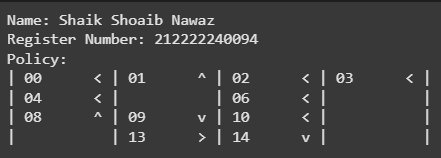

# POLICY ITERATION ALGORITHM

## AIM
To develop a Python program to find the optimal policy for the given MDP using the policy iteration algorithm.

## PROBLEM STATEMENT
The aim of this experiment is to find optimal policy for the mdp using policy iteration. Policy iteration includes policy evaluation and policy improvement where evaluation function is used to find optimal value function of each state and then improvement function is used to find best policy by comparing all the action value function as well as policy.

## POLICY ITERATION ALGORITHM
#### Step1 : 
we are going to do policy evaluation of each state to get the state value function where the initial policy is defined randomly to the mdp.

#### Step2:
Once we obtain convergence in the policy evaluation then implement policy improvement where we are going to find best optimal policy until the previous and current policy are same.

## POLICY IMPROVEMENT FUNCTION
### Name: Shaik Shoaib Nawaz
### Register Number: 212222240094
```
def policy_improvement(V, P, gamma=1.0):
    Q = np.zeros((len(P), len(P[0])), dtype=np.float64)
    # Write your code here to improve the given policy
    for s in range(len(P)):
      for a in range(len(P[s])):
        for prob,next_state,reward,done in P[s][a]:
          Q[s][a]+=prob*(reward+gamma*V[next_state]*(not done))
          new_pi=lambda s:{s:a for s, a in enumerate(np.argmax(Q,axis=1))}[s]
    return new_pi
```
## POLICY ITERATION FUNCTION
### Name: Shaik Shoaib Nawaz
### Register Number: 212222240094
```
def policy_iteration(P, gamma=1.0, theta=1e-10):
   random_actions=np.random.choice(tuple(P[0].keys()),len(P))
   pi = lambda s: {s:a for s, a in enumerate(random_actions)}[s]
   while True:
    old_pi = {s:pi(s) for s in range(len(P))}
    V = policy_evaluation(pi, P,gamma,theta)
    pi = policy_improvement(V,P,gamma)
    if old_pi == {s:pi(s) for s in range(len(P))}:
      break
   return V, pi
```

## OUTPUT:
### 1. Policy, Value function and success rate for the Adversarial Policy


### 2. Policy, Value function and success rate for the Improved Policy



### 3. Policy, Value function and success rate after policy iteration


## RESULT:

Thus, The Python program to find the optimal policy for the given MDP using the policy iteration algorithm is successfully executed.
